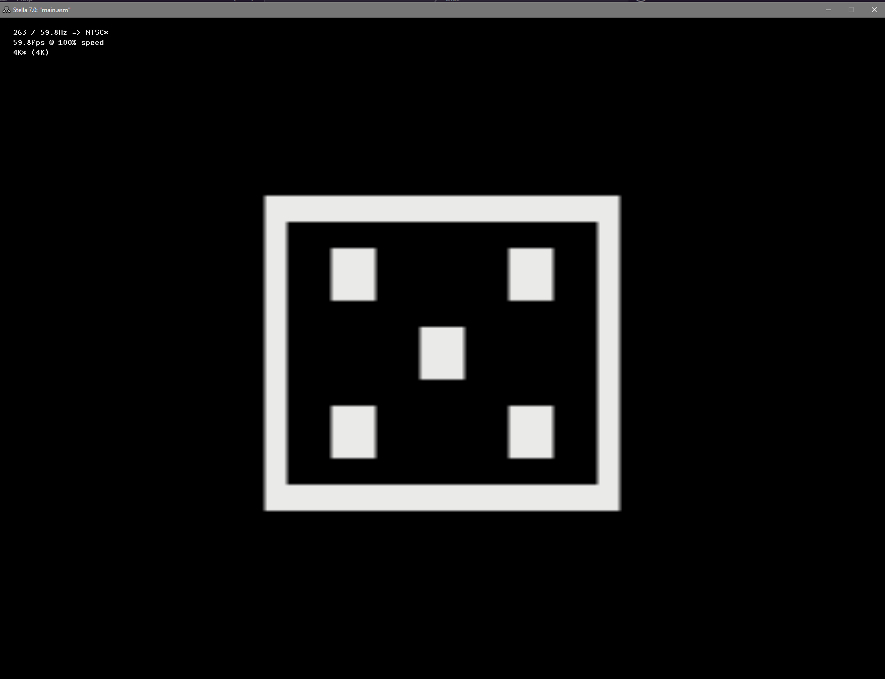

# Atari 2600 Dice App 🎲

Welcome to the most technologically advanced dice roller for the Atari 2600! Why use a boring, physical die when you can harness the raw power of 1977's finest 8-bit hardware to generate a random number between 1 and 6?

## How to Play

1. Power up your Atari 2600 (or emulator, we won't judge).
2. Load this ROM.
3. Stare in awe at the digital dice.
4. Press the fire button to roll. (No actual fire required.)
5. Marvel at your new number. Repeat as needed for all your board game needs.

## Features
- True random(ish) dice rolls
- Authentic 2600 graphics (blocky and beautiful)
- Sound effects that will echo through the ages
- No batteries required (unless your console needs them)

## Why?
Why not?

## Troubleshooting
- If you roll a 7, please contact your local exorcist.
- If nothing happens, it wasn't meant to be

---

May your rolls be ever in your favor!
